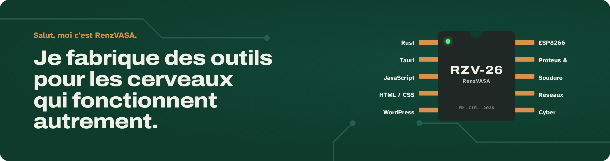

Développeur et électronicien, en Bac Pro CIEL (cybersécurité, informatique et réseaux, électronique). Je fais des apps Mac, des sites web et des cartes électroniques, du circuit imprimé jusqu'à l'interface.

**Portfolio : [renzvasa.github.io](https://renzvasa.github.io)**

### Mes apps

Deux apps Mac gratuites et open source, pensées d'abord pour les personnes neuroatypiques. Tout reste sur l'ordinateur.

| | |
|---|---|
|  | **[Bullo](https://github.com/RenzVASA/bullo)** : étudier sans lutter contre son cerveau. Capture tes cours, repère les devoirs, rappels doux, polices dys. [Télécharger](https://github.com/RenzVASA/bullo/releases/latest) · [Site](https://renzvasa.github.io/bullo/) |
|  | **[Reprise](https://github.com/RenzVASA/reprise)** : reprendre là où on s'était arrêté. Un raccourci sauvegarde apps, onglets et dossiers, un clic remet tout en place. [Télécharger](https://github.com/RenzVASA/reprise/releases/latest) · [Site](https://renzvasa.github.io/reprise/) |

### Autres projets

- **[Vibe Manager](https://github.com/RenzVASA/vibe-manager)** : le public vote pour la musique en scannant un QR code (Node.js, Socket.IO).
- **[Portes ouvertes Bac Pro CIEL](https://renzvasa.github.io/bac-pro-ciel-jpo/)** : site de filière avec quiz d'orientation et tableau de bord en direct (Firebase, Chart.js).
- **[WinDeploy Pro](https://github.com/RenzVASA/WinDeploy_PRO)** : génère le script qui prépare un PC Windows 11 neuf en un clic.
- **[Ambi-Light D1 Mini](https://github.com/RenzVASA/Projet-Ambi-Light-D1-Mini)** : éclairage d'ambiance Wi-Fi avec un ESP8266 et WLED.
- **[FLOW](https://github.com/RenzVASA/FLOW)** : tâches, humeur, habitudes et Pomodoro dans un seul fichier.
- **[Temps d'écran](https://renzvasa.github.io/Temps-decran/)** : enquête et graphiques sur les habitudes numériques d'une classe.

### En ce moment

Je cherche un **stage ou une alternance** en développement, en réseaux ou en électronique.
